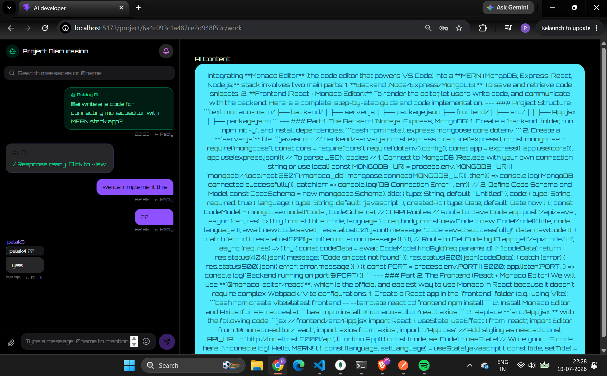
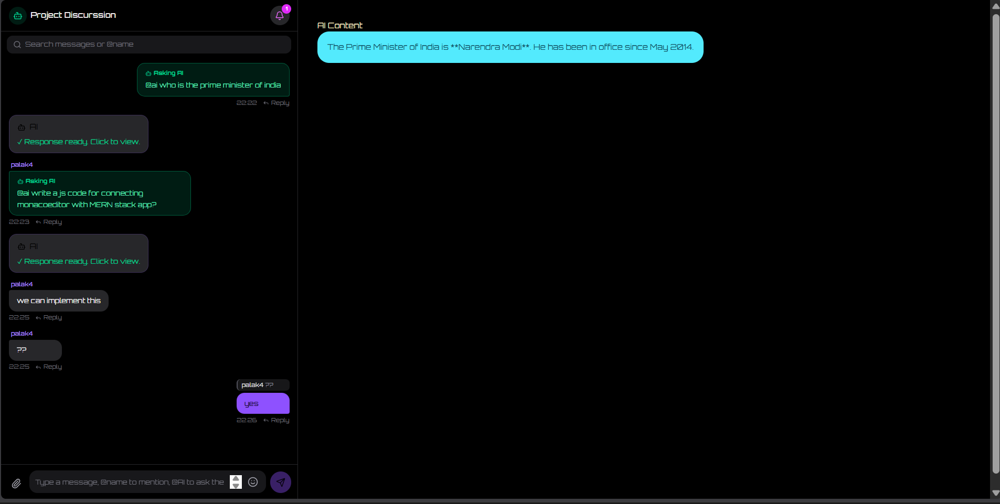
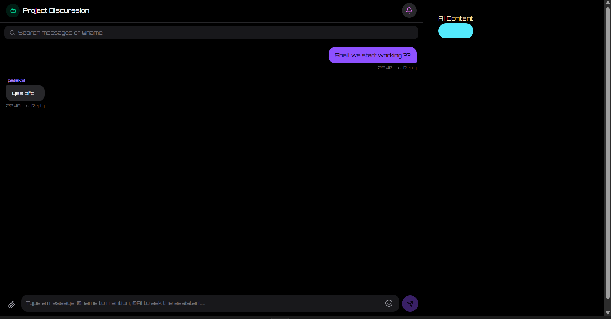
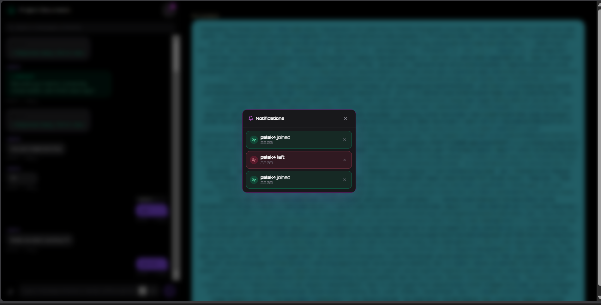

## Progress till 19-07
#### AI integrated , now getting reponse + real time chatting done along with replying 

- chat area created per project 

- user 1 sending prompt to ai for getting response , real time chatting going on alongside with replying seperate reply option 

- what user 2 sees , they are also able to view the other user's question and asnwer for AI

- Before asking AI 

- All other users can see who's joiing or leaving with time in notifications and toast real time 
