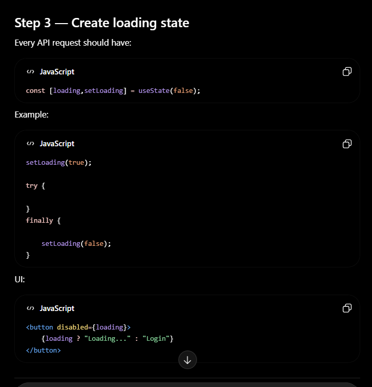

## Error Handling

1. axios instance
2. interceptor
3. loading state
4. error state
5. ErrorAlert component
6. validation errors
7. auth errors
8. network errors
9. server errors
10. toast notifications
11. Error Boundary
12. reusable error components

```js

method : 

example using of - loading usestate
import { useState } from "react";
import api from "../api/api";

export default function Login() {

    const [loading, setLoading] = useState(false);
    const [error, setError] = useState("");

    const handleLogin = async (e) => {
        e.preventDefault();

        try {
            setLoading(true);
            setError("");

            await api.post("/auth/login", {
                email,
                password,
            });

            // navigate("/");

        } catch (err) {
            setError(err.message);
        } finally {
            setLoading(false);
        }
    };

    return (
        <form onSubmit={handleLogin}>
            {/* inputs */}

            {error && (
                <div>
                    {error}
                </div>
            )}

            <button
                disabled={loading}
            >
                {loading
                    ? "Logging in..."
                    : "Login"}
            </button>
        </form>
    );
}
```js
